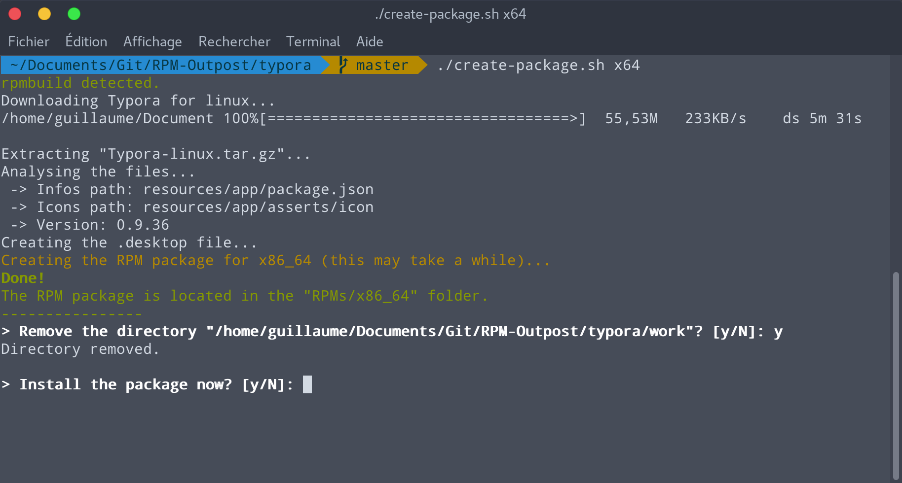

# Typora rpm
Unofficial RPM package for the markdown editor [Typora](https://typora.io).

## How to use
Open a terminal and run `./create-package.sh x64` to create a 64 bits package. Replace `x64` by `ia32` to create a 32 bits package.

## Features
- Downloads the latest version of Typora from the official website
- Creates a ready-to-use RPM package
- Sets Typora as the default markdown editor
- Adds Typora to the applications' list with a nice HD icon
- Tested on Fedora 26 (may work on other distributions)

## Screenshot

